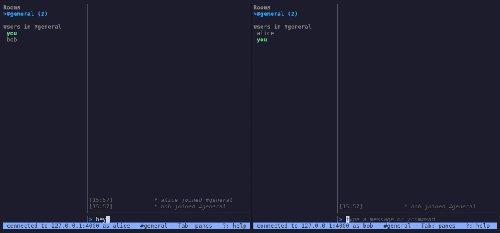
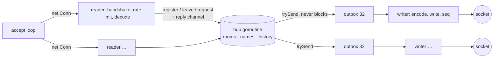
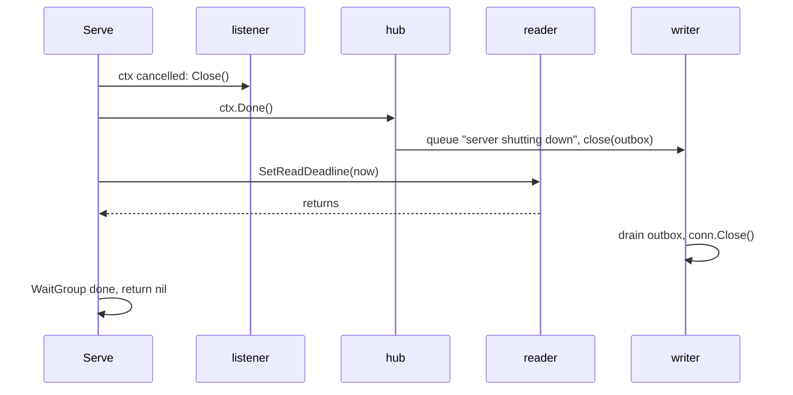

# hearth

[](https://github.com/TamerlanK/hearth/actions/workflows/ci.yml)
[](https://github.com/TamerlanK/hearth/releases/latest)
[](https://goreportcard.com/report/github.com/TamerlanK/hearth)
[](https://pkg.go.dev/github.com/TamerlanK/hearth)
[](LICENSE)

Hearth is a TCP chat server and terminal client in one static binary, written
in Go with the standard library and six dependencies. One goroutine
owns all chat state and talks to every connection over channels, so there is
no lock on the hot path and nothing for `-race` to find; a client that stops
reading loses its own messages and nobody else's. It speaks a line protocol
that works from `telnet` and, after one `HELLO` line, as JSON. On a laptop it
delivers half a million messages a second to 5000 clients with a p99 of 35 ms,
and the profile that says where the rest of the time goes is in the repo.



## Features

- **Rooms, history, DMs, renaming.** `/join` creates a room on first use and
  collects it when empty; the last 50 messages are replayed to you when you
  arrive; `/msg` reaches only the two of you; `/nick` tells your room.
- **Two encodings, one semantics.** Type into `telnet`, or send
  `HELLO hearth/1 json` first and get one JSON object per line.
- **No head-of-line blocking.** Fan-out never blocks the hub. A slow client's
  outbox fills, room traffic to it is dropped and counted, and it is
  disconnected after 100 drops in a row. Replies to its own commands, the
  history replay and the MOTD are never dropped: the server stops reading
  that client's input until they have gone out instead.
- **Hardened by default.** Per-client rate limit checked before decoding, a
  per-address connection cap, line and message caps, handshake and idle
  timeouts, control characters stripped, panics contained to one connection.
- **TLS and a shared secret.** `--tls-cert`/`--tls-key` for transport,
  `--token` for a constant-time checked secret that telnet and JSON clients
  both supply.
- **A terminal UI** with rooms and members, private conversations as
  `@name` tabs, tab-completion, mention highlighting with a bell, unread and
  mention badges, command history, a help overlay and automatic reconnect;
  `--plain` for scripts and pipes.
- **A scripting CLI.** `hearth send` posts a message and exits 0 once the
  server has accepted it; `hearth who` and `hearth rooms` answer in text or
  JSON. The last server and name are remembered, so `hearth connect` alone
  is enough the second time.
- **A Go client library**, `pkg/client`, with request correlation, a bounded
  event channel and jittered reconnect.
- **Operable.** Structured logs, Prometheus metrics, `/healthz`, pprof,
  graceful shutdown with a 5 s drain, a 12 MB distroless image.
- **Measured.** Micro-benchmarks, a load generator, and honest numbers in
  [docs/BENCHMARKS.md](docs/BENCHMARKS.md).

## Quickstart

```sh
go install github.com/TamerlanK/hearth/cmd/hearth@latest

hearth serve                                   # terminal 1: listens on :4000
hearth connect localhost:4000 --name alice     # terminal 2
hearth connect localhost:4000 --name bob       # terminal 3
hearth send "deploy finished"                  # terminal 4: uses the remembered server
```

Type to talk. `/join golang` moves rooms, `/msg bob hi` opens a private
conversation, Tab completes names and commands, `?` opens help, Ctrl+C leaves.
`telnet localhost 4000` works too.

## Install

| How | Command |
|-----|---------|
| Go 1.24+ | `go install github.com/TamerlanK/hearth/cmd/hearth@latest` |
| Release archive | download from [releases](https://github.com/TamerlanK/hearth/releases/latest), verify against `checksums.txt`, put `hearth` on your PATH |
| Docker (server only) | `docker run --rm -p 4000:4000 -p 9090:9090 ghcr.io/tamerlank/hearth:latest` |
| From source | `git clone https://github.com/TamerlanK/hearth && cd hearth && make build` → `bin/hearth` |

Linux, macOS and Windows on amd64 and arm64 are built and tested in CI.

## Usage

### serve

```sh
hearth serve --addr :4000 --metrics-addr 127.0.0.1:9090 --log-format json
```

| Flag | Default | What it does |
|------|---------|--------------|
| `--addr` | `:4000` | Chat listener address |
| `--metrics-addr` | *(off)* | Serve `/metrics`, `/healthz` and `/debug/pprof/` here |
| `--log-format`, `--log-level` | `text`, `info` | `text` or `json`; `debug` … `error` |
| `--max-clients`, `--max-per-ip` | `100`, `10` | Concurrent connections, total and per address (0 = unlimited) |
| `--idle-timeout` | `5m` | Disconnect clients silent this long (0 = never) |
| `--history`, `--default-room`, `--max-rooms` | `50`, `general`, `64` | Messages kept per room; where everyone starts; rooms that may exist |
| `--rate`, `--burst` | `5`, `10` | Sustained lines per second per client, and the burst above it |
| `--max-drops` | `100` | Consecutive dropped events before a client is disconnected |
| `--motd` | *(none)* | Message of the day sent to each client after it joins; newlines make several lines |
| `--token` | *(none)* | Require this secret from every client; prefer `HEARTH_TOKEN` over the command line |
| `--tls-cert`, `--tls-key` | *(off)* | PEM certificate and key; given together, the listener speaks TLS |

Every flag reads `HEARTH_<FLAG>` from the environment when not given on the
command line; `hearth serve --help` names the variable next to each flag.
Ctrl+C or SIGTERM tells every client the server is going away and waits up to
5 s for connections to drain.

### connect

```sh
hearth connect [host:4000] [--name alice] [--room ops] [--plain] [--bell=false]
```

Opens the terminal UI: rooms, private conversations and members on the left,
the transcript on the right, a prompt at the bottom, a status bar under it
that shows the connection, where you are, unread and mention totals, the
focused pane and the last error. It needs 80x24 to look as drawn, drops the
sidebar under 60 columns, follows the terminal's light or dark background,
honours `NO_COLOR`, and reconnects on its own if the server goes away.

The server and name of a successful connection are remembered in
`hearth/config.json` under your user config directory (`--config` or
`HEARTH_CONFIG` to move it), so afterwards `hearth connect` alone is enough.
A name given as `--name` or `HEARTH_NAME` wins over the remembered one, which
wins over your OS user name.

A private message from someone opens a `@name` tab in the sidebar with its own
transcript and badge; a bare line typed in that tab goes to them, `/close`
removes it, and Enter on a user in the sidebar opens one. A message that
contains your name as a word, or any private message, is a mention: the line
is highlighted, the badge shows `@` instead of `•`, and the terminal bell
rings (`--bell=false` to silence it).

Against a server with TLS or a token, add `--tls` (plus `--tls-ca ca.pem`, or
`--tls-insecure` for a self-signed certificate you trust) and `--token`
(or `HEARTH_TOKEN`). `--log-file chat.log` keeps your own transcript. Every
client command pings the server after 30 s without sending anything
(`--keepalive`, `0` to disable), so a server's `--idle-timeout` never ends a
quiet session.

`--plain` is a stdin/stdout line client with no UI and no reconnect, for
scripts:

```sh
echo "deploy finished" | hearth connect localhost:4000 --plain --name ci --room ops
```

`hearth version --json` prints build info; `hearth completion <shell>` prints
a completion script.

### Keybindings

| Key | What it does |
|-----|--------------|
| `Enter` | Send the line; in the rooms pane, join the highlighted room or open a private conversation with the highlighted user |
| `Tab` | Complete a `/command`, a name or a room at the cursor; again to cycle the matches |
| `Tab` / `Shift+Tab` | On an empty line: cycle focus input → messages → rooms |
| `Ctrl+N` / `Ctrl+P` | Join the next / previous room |
| `Up` / `Down` | Command history in the input; scroll the transcript; pick a room |
| `PgUp` / `PgDn` | Scroll the transcript |
| `Ctrl+F` | Search the transcript; Enter and the arrows walk the matches, Esc closes |
| `Ctrl+L` | Clear the current room's transcript |
| `?` / `F1` | Toggle the help overlay (`?` outside the input) |
| `Esc` | Close the help overlay |
| `Ctrl+C` | Close the client and quit |

Commands: `/say`, `/msg <name> <text>`, `/join <room>`, `/nick <name>`,
`/who [room]`, `/rooms`, `/history [room]`, `/away [reason]`, `/ping`,
`/quit`, `/help`, and `/close` for a `@name` tab. A bare line is `/say`, or a private message inside
a `@name` tab.

### send, tail, who, rooms

```sh
hearth send [host:4000] [--room ops] [--to bob] "text"     # or one message per stdin line
hearth tail [host:4000] [--room ops] [--json]              # follow a room until interrupted
hearth who  [host:4000] [--room ops] [--json]
hearth rooms [host:4000] [--json]
```

`tail` is the read side: it prints what happens in a room from now on and
keeps going, so `hearth tail --room alerts | while read -r line; do
notify-send "$line"; done` is a bridge in one line. It does not replay the
room's history, shows only that room plus what is addressed to it, keeps the
connection alive through the server's idle timeout, and reconnects with
backoff if the server goes away. `--json` emits the server's objects for `jq`.

`send` connects, says the text, waits for the server to echo it back and
exits: status 0 means the server accepted it. With no text it sends every line
of standard input for as long as it stays open, so `journalctl -f | grep ERROR
| hearth send --room alerts` works; `--timeout` (10 s) bounds the connection
and each confirmation, not the stream. The server's rate limit applies
(`--rate 5 --burst 10` by default), so a burst above it fails with
`rate limited`. `who` and `rooms` connect briefly as `--name` (the remembered name or
your OS user by default), leave you out of the answer, and print one entry per
line or a JSON document. All three fall back to the remembered server when the
address is left out; a first argument that parses as `host:port` is the
address, anything else is text.

## Architecture

One goroutine, the hub, owns every room, name and history entry. Each
connection gets a reader goroutine that parses lines and a writer goroutine
that drains an outbox in which room traffic is capped at 32 queued events and
the client's own replies never drop. All traffic between them is channels; the
hub never blocks on a client and a client never blocks on a dead hub.



Shutdown is context-driven and the unwind is the same whether the client or
the server starts it: **read loop ends → unregister → hub closes the outbox →
writer drains and closes the socket.**



Why a single hub, why channels, why drop instead of block, why one magic
line for negotiation, and what the trade-offs are, with a goroutine model and
ownership table: [docs/ARCHITECTURE.md](docs/ARCHITECTURE.md). The running log
of non-obvious choices is [DECISIONS.md](DECISIONS.md).

## Protocol

`hearth/1` is line-delimited UTF-8, at most 4096 bytes per line. The server
sends one text prompt; the client's first line is either its name (text mode,
what telnet does) or `HELLO hearth/1 json`, after which every line in both
directions is one JSON object:

```json
{"cmd":"say","text":"hello everyone"}
{"kind":"msg","room":"#general","from":"alice","text":"hello everyone","time":"2026-09-09T15:04:05.123Z","seq":7}
```

Ten commands, eleven event kinds, a per-connection `seq`, documented error
texts, flow control and compatibility rules, and a working Python client:
[docs/PROTOCOL.md](docs/PROTOCOL.md). The Go client library is documented in
[docs/CLIENT.md](docs/CLIENT.md).

## Operations

```sh
hearth serve --addr :4000 --metrics-addr 127.0.0.1:9090 --log-format json --log-level info
docker compose up        # chat on :4000, Prometheus UI on http://localhost:9090
```

- **Logs** are `log/slog` with a stable key set: `event`, `client_id`,
  `remote_addr`, `name`, `room`. Follow `client_id` to trace one connection.
  `--log-format text` (the default) is for people: `16:49:54 INFO  client
  joined  client_id=6d39d0fb name=alice room=#general`, coloured on a
  terminal, `event` omitted because the message says it. `json` carries every
  key for machines.
- **Metrics** on `/metrics`: `hearth_connections_current`,
  `hearth_connections_total`, `hearth_messages_total{kind}`,
  `hearth_dropped_messages_total`, `hearth_rate_limited_total`,
  `hearth_rooms_current`, `hearth_message_fanout_seconds`, plus the Go and
  process collectors. `/healthz` answers `ok`.
- **Profiles** on `/debug/pprof/` on the same port. Keep `--metrics-addr` on a
  private interface: it is unauthenticated.
- **Shutdown**: SIGINT/SIGTERM, every client gets `* server shutting down`,
  5 s drain, exit 1 if it times out.
- **Security**: TLS and a shared-secret token are opt-in and off by default;
  there are still no accounts. Read [SECURITY.md](SECURITY.md) before
  exposing it.

## Benchmarks

Measured on a 10-core laptop with the load generator on the same machine
(details, commands and profile in [docs/BENCHMARKS.md](docs/BENCHMARKS.md)):

| clients | rooms | deliveries/s | delivered | p50 | p99 | server CPU | RSS |
|--------:|------:|-------------:|----------:|----:|----:|-----------:|----:|
| 100 | 1 | 10 000 | 100% | 0.30 ms | 0.64 ms | 9% | 24 MB |
| 1000 | 10 | 100 000 | 100% | 0.30 ms | 0.78 ms | 91% | 65 MB |
| 5000 | 50 | 500 000 | 100% | 3.3 ms | 35 ms | 689% | 246 MB |

The hub hands a message to 1000 outboxes in 35 µs with zero allocations. The
ceiling is the write path: 88% of CPU under load is per-client writers, 55%
of it in `write(2)` because every event to every recipient is one syscall.
Batching writes and encoding once per broadcast are the next changes, and the
benchmarks doc says why they are not done yet.

## Development

```sh
make check         # fmt, vet, lint, test -race: the gate for every change
make bench         # micro-benchmarks
make fuzz          # fuzz both protocol decoders, 10 s each
make build-load    # bin/hearth-load, the load generator
make demo          # re-record demo/demo.gif (needs vhs v0.10.0, ttyd, ffmpeg, tmux)
make release-dry   # goreleaser snapshot into dist/
```

`make fmt` and `make lint` need `golangci-lint`; `make demo` needs
`go install github.com/charmbracelet/vhs@v0.10.0` (v0.12.0 writes no output).
CI runs lint, the race test matrix on three OSes and two Go versions, a fuzz
smoke, cross-compilation, `govulncheck` and a Docker build. Releases are
tag-driven: `git tag v0.1.0 && git push origin v0.1.0` builds six platforms
and pushes the image. How to get a change in is
[CONTRIBUTING.md](CONTRIBUTING.md), the house style is
[docs/STYLE.md](docs/STYLE.md), and the changelog is
[CHANGELOG.md](CHANGELOG.md).

## Roadmap

1. Batch writes and encode once per broadcast (the profile says two thirds of
   server CPU).
2. Coalesce join notices in large rooms, so connect storms are linear.
3. Request ids in `hearth/2` so the client can run concurrent requests.
4. Append-only history persistence per room.
5. Membership in several rooms at once, rather than one at a time.

## License

[MIT](LICENSE).
